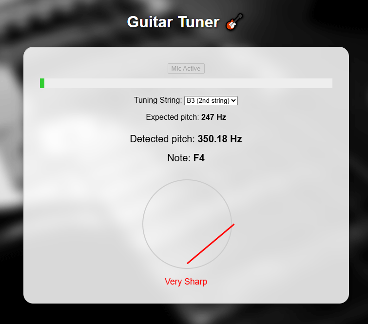

# Guitar Tuner

A responsive web-based guitar tuner built with React and Web Audio API.  
It detects pitch from your microphone input in real time and shows tuning accuracy with a rotating needle interface.

## Live Demo

👉 [Try the tuner online](https://guitar-tuner-taupe.vercel.app/)  

---

## Features

- Microphone pitch detection (uses autocorrelation)
- Tuning needle that shows sharp/flat offset
- Cents offset display and color-coded feedback
- Mobile-friendly responsive layout
- String selection with expected pitch display
- Helpful tuning labels: `In Tune`, `Very Sharp`, `Very Flat`

---

## Technologies

- React + Vite
- Web Audio API
- CSS + inline styles for layout

---

## Screenshot

This shows a perfectly tuned string.


This one is very sharp and needs tuning.



Here's how it looks on a mobile phone.


---

## Getting Started (Dev)

```bash
git clone https://github.com/cqmeronn/Guitar-Tuner
cd guitar-tuner-web
npm install
npm run dev
